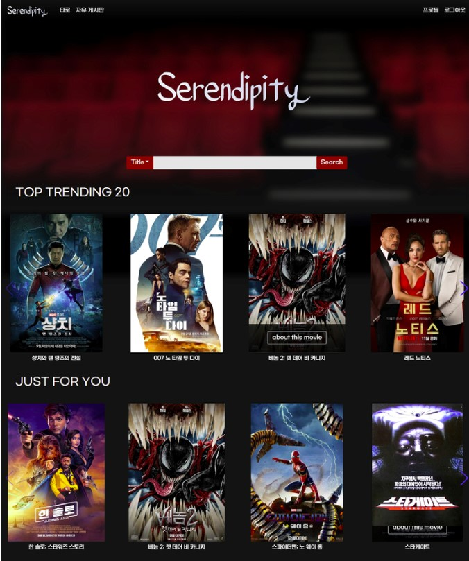

# 리드미

# 🌌 Serendipity Project

------

> 영화 추천 서비스 프로젝트

## 🌐 배포 주소

------

> serendipity-pjt.click

## ☺️초록

------

뜻 밖의 재미나 횡재라는 뜻의 Serendipity라는 이름과 함께 사용자에게 새로운 영화를 찾는 소소한 감동을 전해드리는 영화 추천 서비스 페이지입니다.

## 🤼팀

------

- 기능별 역할 분담
  - 배하은 (팀장)
    - 유저 관련 기능
    - 커뮤니티 관련 기능
    - 타로
  - 윤창목
    - 영화 데이터 관련 기능
    - 커뮤니티 관련 기능 일부

## 🛠️기술 스택

------


## 📜기능 일람

------

| 앱                                                     | 기능                          | 기능 설명                                                    |
| ------------------------------------------------------ | ----------------------------- | ------------------------------------------------------------ |
| accounts                                               | 회원가입 / 로그인             | JWT 토큰을 이용한 사용자 회원가입 및 로그인 구현             |
| 회원가입시 불가능한 username, password 값 처리         |                               |                                                              |
| accounts                                               | 로그아웃                      | loacalStorage에 저장한 JWT토큰, vuex userStore에 있는 사용자 정보 제거 |
| movies                                                 | tmdb 자료 추출 및 DB화        | tmdb API를 활용하여 1400여개의 영화와 장르 DB에 저장         |
| movies                                                 | 메인 페이지                   | Top Trend 20개와 인증된 사용자는 사용자별 맞춤 영화 추천 리스트 표현 |
| movies                                                 | Top Trend 20                  | 'popularity' 키값 순으로 인기있는 영화 20개 추천             |
| movies                                                 | 사용자 맞춤 영화 추천         | 협업 필터링과 사용자가 선호하는 영화의 장르 점수를 누적하여 사용자의 취향에 맞는 영화 큐레이팅 |
| movies                                                 | 영화 검색                     | 영화의 제목과 장르를 기준으로 검색 기능 구현                 |
| 검색 결과 페이지는 무한 스크롤 적용                    |                               |                                                              |
| movies                                                 | 영화 디테일 페이지            | 영화 세부 정보 표현, 인증된 사용자는 좋아요나 보고싶은 영화 리스트에 등록하고 리뷰를 조회하거나 남길 수 있음 |
| movies                                                 | 영화 좋아요, 보고싶어요 기능  | 해당 영화에 좋아요, 보고싶어요 기능을 구현하고, 해당 영화를 얼마나 많은 사용자가 좋아요, 보고싶어요를 했는지 숫자로 확인 |
| movies                                                 | 영화 리뷰 CRUD                | 영화 상세 페이지에서 해당 영화의 리뷰들을 확인할 수 있고, 개수가 많은 경우 더보기 버튼을 통해 추가적으로 불러올 수 있다 |
| 리뷰는 작성자만이 수정, 삭제가 가능                    |                               |                                                              |
| movies                                                 | 영화 리뷰 좋아요              | 인증된 사용자는 영화 리뷰에 대해 좋아요 기능 구현            |
| movies                                                 | 영화 리뷰 댓글 CRUD           | 영화 상세 페이지에서 해당 영화의 리뷰들을 확인할 수 있고, 개수가 많은 경우 더보기 버튼을 통해 추가적으로 표현 |
| 리뷰 댓글은 작성자만이 수정, 삭제가 가능               |                               |                                                              |
| movies                                                 | 영화 리뷰 댓글 좋아요         | 인증된 사용자는 영화 리뷰 댓글에 대해 좋아요 기능 구현       |
| movies                                                 | 타로 영화 명대사 출력         | 인증된 사용자에게 타로 카드를 뽑기 전 영화 명대사 Top 100 중 하나를 표현 |
| movies                                                 | 타로 카드 선택                | 6개의 타로 카드 중 하나를 선택하면 해당 카드의 영화를 사용자에게 추천 |
| community                                              | 전체 게시글 조회              | 자유 게시판 페이지에서 전체 게시글을 무한 스크롤로 출력      |
| 좋아요가 많은 순으로 게시글 정렬                       |                               |                                                              |
| community                                              | 단일 게시글 CRUD              | 단일 게시글을 생성, 조회할 수 있으며 작성자만 수정, 삭제 구현 |
| community                                              | 단일 게시글 좋아요            | 단일 게시글에 좋아요 기능 구현                               |
| community                                              | 게시글 댓글 CRUD              | 해당 게시글의 댓글을 생성, 조회할 수 있으며 작성자만 수정, 삭제 구현 |
| community                                              | 게시글 댓글 좋아요            | 해당 게시글의 댓글에 좋아요 기능 구현                        |
| accounts                                               | 프로필 페이지                 | 해당 사용자에 대한 전체적인 정보 확인                        |
| accounts                                               | 프로필 이미지 변경            | 8개의 이미지 중 하나를 골라 자신의 프로필 이미지 변경 가능   |
| accounts                                               | 사용자 팔로우                 | 사용자간의 팔로우 및 팔로잉 기능 구현과 팔로워 및 팔로잉 목록 조회 |
| accounts                                               | 사용자별 영화 조회            | 해당 사용자가 좋아요, 보고싶어요를 한 영화 목록 최신순으로 조회 |
| sequential entrance로 순차적으로 상 → 하 방향으로 출력 |                               |                                                              |
| accounts                                               | 사용자별 영화 리뷰, 댓글 조회 | 해당 사용자가 작성, 좋아요한 영화 리뷰와 작성한 영화 리뷰 댓글 조회 |
| accounts                                               | 사용자별 게시글, 댓글 조회    | 해당 사용자가 작성, 좋아요한 게시글과 작성한 게시글 댓글 조회 |
| accounts                                               | 비로그인 next redirect        | 비로그인한 사용자가 인증이 필요한 페이지에 접근시 로그인 페이지로 이동 후 로그인을 하고나면 원래 요청한 주소로 redirect |
|                                                        | 404 페이지                    | 없는 영화, 게시글, 프로필 접근시 404 page 출력               |
|                                                        | admin 페이지                  | 사용자, 영화 정보를 관리할 수 있는 관리자 페이지 구현        |

목표한 기능은 95% 이상 구현하였습니다.

## 🗃️ERD

------


## 📋개요

------

### 🎥메인 페이지



- 네온의 분위기가 영롱한 극장, 나란히 늘어선 팝콘, 영화가 시작하기 직전 조명 아래 설레는 분위기의 좌석이 랜덤으로 배경에 보이는 메인 페이지입니다.
- 비회원 사용자는 현재 트렌딩 20개의 영화의 목록을 볼 수 있고, 회원 사용자는 그와 함께 개인 맞춤으로 추천받는 영화의 목록을 볼 수 있습니다.
  - 좋아요를 한 번도 하지 않아 취향이 분석되지 않은 사용자는 "어떤 영화를 좋아하시나요?"라는 문구로 사용자의 평가 참여를 유도합니다.

### 🔐회원가입 & 로그인


- 메인페이지와 같은 배경으로 사이트의 통일성을 추구하였습니다.
- 회원가입
  - 아이디와 비밀번호의 입력값을 확인하여 조건에 맞지 않을경우, 에러 메세지를 상단에 출력하고 다시 입력하도록 하였습니다. 값 처리는 vue에서 구현하였습니다.
  - 사용자의 편의를 위해 아이디와 비밀번호의 조건을 input form 상단에 출력하고 autofocus를 적용했습니다.
- 로그인
  - 회원가입에 성공하면 로그인 페이지로 자동으로 이동합니다. 회원가입후 로그인을 했다면 메인페이지로 이동하고, 영화 상세정보 페이지에서 왔다면 이전 위치로 이동합니다.
  - 회원 가입과 마찬가지로 autofocus를 적용했습니다.

### 🔎영화 검색

- 페이지에 방문한 모든 사용자는 영화 검색을 할 수 있습니다.
  - 영화 검색은 제목 검색이나 장르 검색 두 가지 중 하나의 방식을 골라 진행합니다.
    - 제목 검색 결과로는 입력한 검색어를 포함한 제목의 영화들이 표시됩니다.
    - 장르 검색으로 전환하면 혼동을 방지하기 위해 검색어 입력 필드와 검색 버튼이 비활성화되며, 아래에 현재 DB에서 조회할 수 있는 장르에 대한 버튼이 표시됩니다.
      - 그 중 하나를 선택하여 누르면 해당 장르를 포함한 모든 영화를 표시합니다.

### 🍿영화 디테일 페이지


- 영화 디테일 페이지는 상단의 영화 정보와 하단의 리뷰 섹션으로 크게 나뉩니다.
- 영화 정보 섹션은 사용자가 접속한 기기의 형태에 따라 반응형으로 배치가 바뀝니다.
  - PC 크기의 뷰포트의 경우 포스터는 좌측에, 나머지 정보는 오른쪽에 정렬됩니다.
  - 모바일 크기의 경우 포스터가 상단으로 올라가고 나머지 정보는 아래쪽에 표시됩니다.
- 회원 사용자의 경우 리뷰 섹션에서 해당 영화에 사용자들이 남긴 리뷰를 보거나 자신의 리뷰를 남길 수 있습니다.
  - 각 리뷰별로 좋아요를 할 수도 있고, 리뷰에 대한 댓글을 추가할 수 있습니다.

### 🔮타로 페이지


- 명대사
  - 타로 페이지에 입장하면 사용자에게 감성적인 문구를 보이고 난 뒤 문구를 클릭하면 fade 애니메이션을 진행합니다.
  - 영화 명대사 Top100 중 한 대사를 골라서 출력합니다.


- 타로 카드
  - 타로 카드 6장이 오른쪽에서 왼쪽으로 순차적으로 들어오는 애니메이션이 진행됩니다.
  - 사용자가 한장을 고르면 해당 카드에 맞는 영화를 보여주고, 뽑은 카드를 클릭하면 해당 영화 상세 페이지로 이동합니다.

### 📰자유게시판


- 전체 게시글 목록
  - 모든 게시글을 '좋아요'가 많은 순서대로 정렬하여 출력합니다.
  - 한 게시글마다 작성자의 프로필 이미지, 작성자 이름, 작성 일자, 좋아요 수를 출력합니다.
  - 작성자 이름을 클릭하면 해당 작성자의 프로필 페이지로, 게시글 제목을 클릭하면 해당 게시글로 이동할 수 있습니다.
  - 게시글 작성자가 본인이라면 '나'라는 뱃지를 표시해 자신의 글임을 확인하기 쉽게 하였습니다.
  - 게시글은 무한 스크롤로 로딩하며 한번에 10개씩 불러옵니다. 모든 글을 불러왔다면 '끝!'이라는 문구가 출력됩니다.
- 게시글 상세
  - 게시글의 내용, 작성 시간, 수정 시간, 작성자, 좋아요수, 댓글 수를 표현합니다.
  - 접속한 사용자가 좋아요의 색이 채워지면서 좋아요 수가 증가합니다.
  - 게시글, 댓글 모두 작성자의 이름을 누르면 해당 유저의 프로필 페이지로 이동합니다.
  - 댓글
    - 댓글 목록은 5개를 먼저 보이고, '더 보기' 버튼을 누르면 모든 댓글을 표현합니다.
    - 각 댓글에 좋아요를 할 수 있고, 해당 댓글의 좋아요 수가 보입니다. 댓글은 오래된 순으로 출력됩니다.
    - 아이콘을 최대한 심플하게 만들어 깔끔한 느낌을 주려고 하였습니다. 예외로 좋아요 버튼은 누르면 색이 채워지고, 삭제는 경고의 의미를 주기 위해 붉은 outline 아이콘으로 표현하였습니다.

### 👤사용자 프로필 페이지


- 프로필 페이지에서는 현재 조회하고 있는 사용자의 프로필이 표시됩니다.
  - 본인이 아닌 사용자의 프로필 페이지에서는 해당 사용자를 팔로우할 수 있는 버튼이 추가로 표시됩니다.
  - 팔로워, 팔로잉 수를 출력하고 '목록 보기' 버튼을 누르면 모달 창으로 팔로워와 팔로잉 유저 목록을 표시하였습니다.
  - 본인의 프로필 페이지에서는 미리 정해진 8개의 프로필 대표 사진 중 하나를 골라 변경할 수 있는 메뉴가 추가로 표시됩니다.
- 그 아래에는 해당 사용자의 서비스 참여 통계가 간략하게 표시됩니다.
  - 집계되는 통계는 다음과 같으며, 해당 수치를 클릭하면 그 목록이 표시됩니다.
    - 좋아하는 영화 수
    - 보고싶은 영화 수
    - 작성한 영화 리뷰 수
    - 좋아하는 영화 리뷰 수
  - 또한 작성한 게시글, 좋아하는 게시글, 작성한 리뷰 댓글, 작성한 게시글 댓글을 최근 건수 5개까지 간략하게 표시합니다.
    - 작성한 게시글과 좋아하는 게시글은 '더보기' 버튼을 누르면 목록을 표시하는 페이지로 이동합니다.
- 가장 하단에는 회원 정보 수정 버튼이 있고, 비밀번호를 변경할 수 있는 페이지로 이동합니다.
  - 회원 정보 수정 페이지의 하단에는 경고의 의미를 주기 위해 회원 탈퇴 버튼이 존재합니다.
    - 사용자의 주의가 필요하기 때문에 프로필 페이지에서 한 단계 더 들어가서 진행할 수 있도록 하였습니다.

### ⚠️비인증 사용자

- 인증되지 않은 사용자는 영화 정보를 검색하고, 개별 영화의 상세 정보를 조회할 수 있지만, 그 외의 기능에는 접근할 수 없습니다.

### ⛔잘못된 요청


- 존재하지 않는 고유키의 영화, 자유게시판 글, 혹은 사용자 조회를 시도할 경우 404 에러를 나타내는 페이지로 리디렉션되며, 하단에 홈으로 되돌아가는 버튼이 같이 나타납니다.

## 🖥️빌드

------

- SERVER - loddata 순서 **중요**

```bash
$ cd final-pjt-back
$ python -m venv venv
$ source venv/Scripts/activate
$ pip install -r requirements.txt # 리눅스 환경에서는 requirements_c9.txt
$ python manage.py loaddata fixtureg.json
$ python manage.py loaddata fixturem.json
$ python manage.py loaddata fixturea.json
$ python manage.py loaddata fixturec.json
$ python manage.py runserver
```

- CLIENT

```bash
$ cd fianl-pjt-front
$ npm i
$ npm run serve
```

## 👍느낀점

------

- 하은

  - 무식한사람이 용감하다고
    - 처음 시작할땐 이렇게까지 어려울게 없다고 생각했습니다. 사용자, 커뮤니티, 영화 모두 배웠던 내용이기 때문입니다. (그나마 배워서 이정도인가 싶긴 하지만..) 하지만 프로젝트 기간 동안 '왜 안돼?' 와 '왜 그러지ㅠㅠ'를 연발하며 고통받았습니다. 그래도 그 과정에서 느낀 점은 어느정도 기반이 있기 때문에 많이, 빠르게 배울 수 있었다는 점입니다. 특히 django의 serializer에 대한 개념을 배웠지만 하나도 자리가 잡히지 않은 상태로 시작해서 BackEnd를 처음에 구현할 때 '왜 이렇게 해야하는거지?' 하면서 복습을 겸했습니다.
  - 물귀신 같은 에러
    - 에러 해결이 참 어려웠습니다. 물론 구글에 검색하면 제가 궁금한 점을 분명 누군가는 질문해뒀기 덕분에 빠르게 문제를 해결할 수 있었습니다. 프로젝트를 하면서 지식을 배운 점도 있지만 '어떻게 검색해야하는지'에 대한 능력도 성장했다고 생각합니다. 막바지에 이를 수록 에러가 날 때마다 절대 쉽지 않구나.. 라고 느꼈습니다.
    - 그리고 기초 이론의 중요성을 느낄 수 있었습니다. 모호한 이미지를 그리며 '이렇게 하면 되겠지~'하고선 만든게 안될 때 '왜' 작동하지 않는지 알려면 그 원리를 알아야 했습니다. 플젝기간동안 이 부분에 대해선 많이 배우진 못 했지만 중요성을 체감하였습니다.
  - 사람과 좀비 사이
    - 일주일이 넘는 기간동안 잠도 잘 못자고 하루 전체를 프로젝트에 매달렸습니다. 살면서 이렇게까지 전력으로 한가지 일에 몰두해본 적이 있었나 라는 생각이 들며 저 자신을 되돌아봤습니다.
    - 코딩이 재밌다는 사람들 다 허풍쟁이라고 생각했는데 프로젝트를 해서 너무 힘들면서도 유튜브를 보며 빈둥대느니 프로젝트가 더 하고싶다는 생각을 하는 스스로를 발견했습니다. 싸피에 들어오기전 하고싶은 일을 직업으로 갖는 것에 회의를 가졌고 개발을 하면 먹고는 살 수 있겠지 라고 생각하며 들어왔는데, 지금도 솔직히 크게 생각이 바뀌진 않았지만 그래도 제가 개발을 즐기긴 한다는걸 깨달았습니다.
    - **엄청난 능력자**인 윤창목님과 함께 하루종일 디코에 붙어살면서 했기 때문에 제가 막혀도 페어가 해결해주니까 에러 하나를 오래 붙들지 않아서 좌절하지 않았고, 또 페어의 문제는 제가 도와주면서 서로 시너지를 내서 재밌다고 느낀 것 같습니다. 🚌 그리고 git branch를 합칠 때마다 충돌이 거의 안나서 신기해 하며 작업할 수 있었습니다. (133 커밋동안 conflict 6번 😮)
    - 주제가 정해져있고 어떻게 해야할지 방향은 아니까 더 재밌다고 느낀 것 같습니다. 이번 프로젝트는 뿌듯하고, 힘들고, 괴롭고, 성장하는 경험이었지만, 회사에서 이런 강도로 일했다면... 🏃🤮
  - 기록의 중요성
    - 어떤 에러를 해결하고 나서 최대한 매번 기록하려고 노력했습니다. 그러니 플젝을 하면서 똑같은 에러를 마주했을 때 제 얄팍한 기억력이 아닌 문서에서 검색하면서 빠르게 해결할 수 있고 더 오래 기억에 남길 수 있었습니다.
    - 개발자에겐 문서를 잘 작성하는 것도 꽤나 메리트 있는 장점이라고 들었는데 그 중요성을 한번 더 느낄 수 있었고, 플젝하면서 날림으로 작성한 제 trouble shooting 기록을 다듬어야겠다고 생각했습니다.

- 창목

  > *"마지막까지 버그맨이 쓰러지지 않아...!" - 마감 2시간 전의 윤창목*

  - 지난 한 주를 돌아보며

    - 여러가지 의미에서 발견의 연속이었던 한 주였습니다.
    - 짧은 시선으로는 버그가 일어났을 때 어떻게 해결해야 하는지 해결책을 발견,
    - 조금 더 긴 시선으로는 하나의 프로젝트는 시작부터 끝까지의 과정은 어떤 것인지, 중간에 어떤 사건 사고가 일어날 수 있으며, 그에 대한 해결은 어떻게 해결해야 하는가에 대한 발견,
    - 장기적인 시선으로는 저를 이토록 한 주 동안 단 한 가지에만 몰입하게 하는 것에 대한 발견의 연속이었다고 말하고 싶습니다.
      - 게임을 많이 좋아하는 사람인데, 오히려 이번 프로젝트를 하면서는 게임에 손이 안 가더군요;;;

  - 이번 프로젝트를 이끈 원동력

    - 저는 지난 한 주 동안 제가 만나는 사람들에게 (이 시국에 가족이 전부긴 합니다만,) 이번 프로젝트에는 진짜 목숨을 걸었다고 말하고 다녔습니다.
      - 그 한 마디만으로 밤 늦게까지 의논하느라 방구석에서 두문불출하고 소리나 지르는 저를 이해해준 가족들에게 감사하다는 말을 이따 전해야겠습니다.
    - 이번 프로젝트에 대해 목숨까지 언급한데에는 평가라는 요소도 있을테지만 제가 꼽는 이유는 그와 거리가 멉니다. 학부 때 이와 비슷한 프로젝트를 팀 과제로 해본 적이 있긴 합니다만, 당시엔 제 능력에 대한 불신으로 부족한 자신감과 덩달아 참여도도 수준 미달이었습니다.
    - 다시 한 번, 제게 명세가 주어진 프로젝트를 시작하면서 그 때의 과오를 씻고 싶었을지 모릅니다. 뭔가 제가 직접 참여한 작업의 결과물이 소위 "간지나게" 작동하는 것을 남들 보여주기 전에 제 스스로 보고 싶었기도 합니다.

  - Special Thanks

    - 저는 목숨을 건다고 그악스럽게 덤볐지만, 제 무자비한 작업 박자를 맞춰준 팀장 배하은씨에게도 감사의 인사를 전합니다.
    - 버그는 싫지만 버그를 잡고 났을 때의 쾌감을 좋아하는 제가 컴퓨터 앞에만 앉아 있으면 그 동안 저와 계속 함께 해준 우리 팀장님 덕분에 많은 도움을 얻고 더 빠르게 작업할 수 있었습니다. 혼자서는 못 했을 일이 구현된 적도 있었던 만큼 이번 프로젝트에 함께해줘서 고맙다는 말을 전하고 싶네요.

  - 아찔했던 순간들

    - 인생에 큰 전환점이 될 만큼 세상 맛있게 먹은 음식이나 절대 잊고 싶은 과거는 꼭 기억에 오래 남는다고 하죠. 그렇게 많은 버그와 사고들이 오고갔던 한 주를 거쳐오면서 아직도 기억나는 순간들이 있다면 이 기억은 얼마나 갈까요?

      - *"또 마스터에다 작업했어!"*

        > 솔직히 이 기억은 오래 가면서도 계속 반복될 것 같긴 합니다.

      - 모델링의 중요성

        - 초반에 모델링을 탄탄히 잘 했다고 생각했는데 프로젝트 하다가 발견한 구멍에 DB를 갈아엎고 초기 데이터를 다시 찾을 때의 그 아찔함은 다신 겪고 싶지 않습니다.

      - HTML / CSS로 이미지 가로세로 비율 고정하여 반응형 구현하기

        - `height: 2*width;`가 된다면 얼마나 좋을까요...

        - `aspect-ratio`속성이 현재 초기 개발자 버전으로 테스트 되고 있다는 소식을 얼핏 듣긴 했습니다.

          - 꼭 정식 버전으로 빨리 올라오기를...

        - 그래서 스택 오버플로우에서 찾은 위에 비어있는 dummy div를 하나 놓고 그 아래에 사진을 놔서 dummy div의 padding-top으로 비율을 고정하는 테크닉을 찾긴 찾았는데, 아직도 이해는 못했습니다.

          - 같이 읽고 이해하신 분은 제게 좀 알려주세요.

          > [Height equal to dynamic width (CSS fluid layout) - Stack Overflow](https://stackoverflow.com/questions/5445491/height-equal-to-dynamic-width-css-fluid-layout?rq=1)

      - 코사인 유사도 측정을 통한 협업 필터링

        - 참 어려운 주제였던 만큼 어려운 순간도 많았습니다.
        - 그 놈의 Key Error...
          - 한 번은 탈퇴한 회원이 생기면 발생했었고,
          - 또 한 번은 좋아요를 한 영화 갯수가 0으로 되돌아가면 발생했었다.